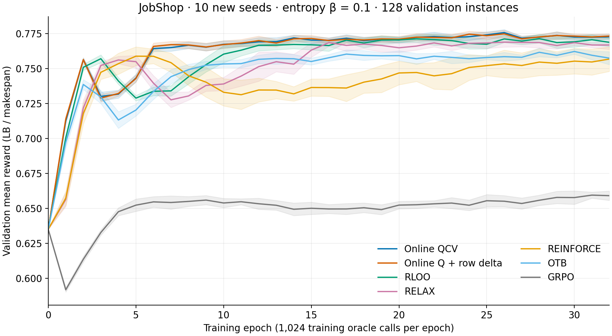

# Results: seven methods × ten new seeds

Seeds 10–19, entropy beta 0.1, 32 epochs, train/validation/test sizes 128/128/128. All 70 training runs and frozen-checkpoint test evaluations completed; all 35,840 test candidates were feasible.

| Method | Train epoch 32 | Selected validation | Test mean ± seed SD | Test Best-of-4 ± seed SD |
|---|---:|---:|---:|---:|
| qcv | 0.76675 | 0.77790 | 0.76316 ± 0.00163 | 0.83161 ± 0.00103 |
| row_delta | 0.76724 | 0.77775 | 0.76227 ± 0.00303 | 0.83192 ± 0.00123 |
| reinforce | 0.75705 | 0.76882 | 0.76024 ± 0.00720 | 0.81904 ± 0.00857 |
| rloo | 0.76376 | 0.77591 | 0.75964 ± 0.00304 | 0.82865 ± 0.00125 |
| relax | 0.76135 | 0.77400 | 0.75750 ± 0.00269 | 0.82911 ± 0.00182 |
| otb | 0.75380 | 0.76600 | 0.74802 ± 0.00590 | 0.82688 ± 0.00175 |
| grpo | 0.65640 | 0.66446 | 0.65243 ± 0.00397 | 0.79340 ± 0.00155 |

QCV has the highest mean test reward; row delta has the highest mean test Best-of-4. Their paired differences are small: row minus QCV is -0.000893 for mean reward (95% paired t interval [-0.002745, 0.000959]) and +0.000310 for Best-of-4 ([-0.000449, 0.001069]). These intervals cover training-seed variation on a fixed test set; neither establishes superiority. No test-based checkpoint reselection was performed.

Train values above are sampled epoch-32 averages, not scores of the validation-selected checkpoints. Validation and test values are from each run's selected checkpoint. See `per-seed.csv` for selected epochs and individual scores.

## Learning and convergence

Curves are per-epoch validation mean reward, averaged across ten seeds; bands are pointwise 95% t intervals. They are not best-so-far curves. At the descriptive threshold of three consecutive epochs with validation reward >= 0.76, all ten seeds succeed for QCV (median starting epoch 6), row delta (6), RLOO (11), and RELAX (15.5). OTB succeeds in 7/10 and REINFORCE in 6/10; their medians among successful seeds are 20 and 21, respectively. GRPO has 0/10. At 0.77, QCV and row delta both succeed 10/10, with medians 19.5 and 18. These post-hoc thresholds are descriptive, not preregistered significance tests, and do not measure wall-clock speed.

No per-epoch gradient variance was measured in this campaign. Epoch-average gradient norms are preserved as diagnostics and must not be relabeled as variance.

## Audit and scope

`scripts/summarize_results.py` verifies all test means/Best-of-4 against per-instance records, verifies validation selection including ties, and matches selected-checkpoint hashes. `results/provenance/` preserves the original campaign protocol, source snapshots and environment freeze. The historical source and portable wrappers are distinguished in the README. Earlier campaigns and later hyperparameter sweeps are excluded.
